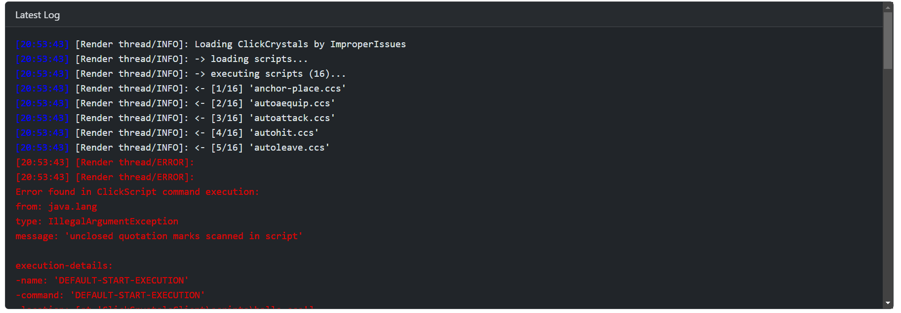
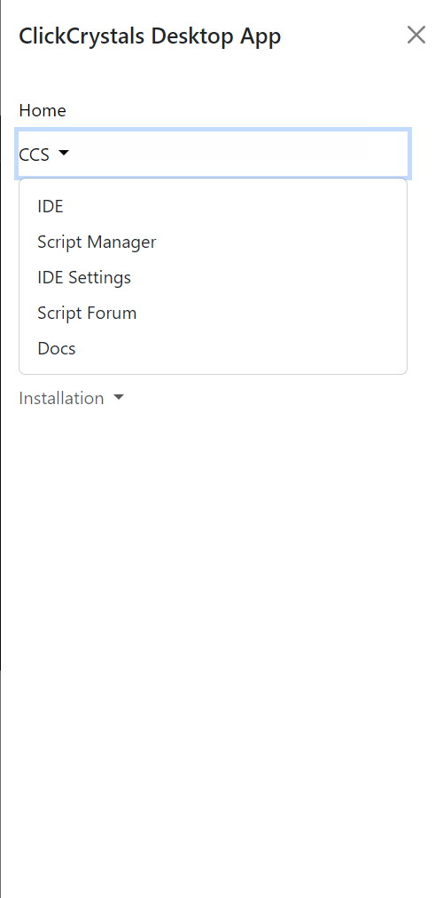

# ClickCrystalsDesktopApp

ClickCrystals tool made for levelling up your ClickCrystal Experience!

**We're currently in beta versions, only full releases will be exported and published, betas will be provided for you to build/modify.**


## Installation

You can either install this application via a built exe provided in Tutla's Projects Discord Server **OR** build it a modified version using pyinstaller.

### Built Installation

**Please remember, only published releases will recieve built installations. Betas will be needed to be deployed by yourself.**

Downloads of this application will be provided across verious platforms. The platforms are listed below:

- [Tutla Website](https://tutla.net)
- [Tutla Project Discord](https://discord.gg/kwpkVa5PeJ)
- [ClickCrystals Website](https://clickcrystals.xyz/projects)

All of the above contain both .zip and .exe installations. These are made for Windows systems and may not be compatible with MacOs and Linux. **You will have to export it yourself.**

### Modified/Custom Installation

To launch a custom installation you will require:

- Python 3.9+
- EEL Python Library
- Pyinstaller Python Library

1. #### Install [Python](https://www.python.org/downloads/https://www.python.org/downloads/) 3.9


   - Make sure it has pip
   - Python should be set in the environmental variables
2. #### Install Pyinstaller & EEL


   1. Open command promptor terminal
   2. Execute this:   `pip install eel pyinstaller `
3. #### Export the file

   Open up terminal on the folder in which you unzipped a copy of the app, then execute this:


   ```bash
   python -m eel main.py web --exclude win32com --exclude numpy --exclude cryptography --onefile --noconsole --debug all
   ```

If you did it sucessfully, **you should move the `main.py` file from the `dist` directory to the directory with the `settings.json ` and `default_settings.json.`**

Then it should execute and you will have a working installation of the app

If you do encounter any issues, first check if you can fix it yourself. When I was testing this I had encountered an error with bottle which I'll explain in the fixes section. Googling and reporting didn't help, but removing the 5 lines of code did.

## Features

The ClickCrystals Desktop App level ups your experience in ClickCrystals in the following ways.

### Custom Logger

The Custom Logger will display the ClickCrystal log in a colorful manner that is more soothing to the eye. It will display the current.log file which is located in the corresponding ClickCrystal directory.



### Easy Management

The Sidebar provides a miday to access all the features, to access it click on the hamburger menu at the top right.



### CCS Editor

The Editor is currently under development, it aims to provide a more joyful experience with color coding, tab completions and most importantly: prebuilt modules.

The best part about this is the prebuilt modules. In CCS there is no way to import, but we have made some prebuilt functions and you can add an import statment in your code to access all those functions.
